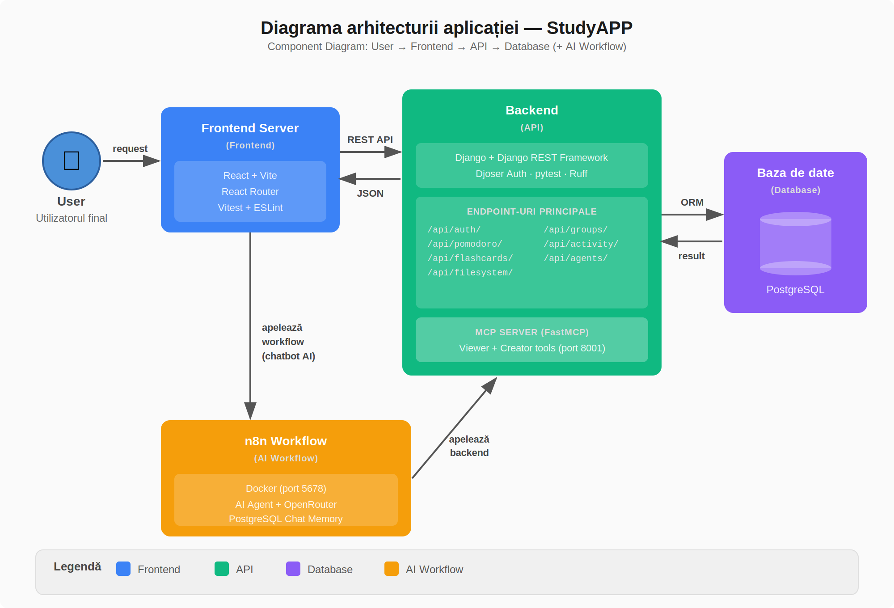
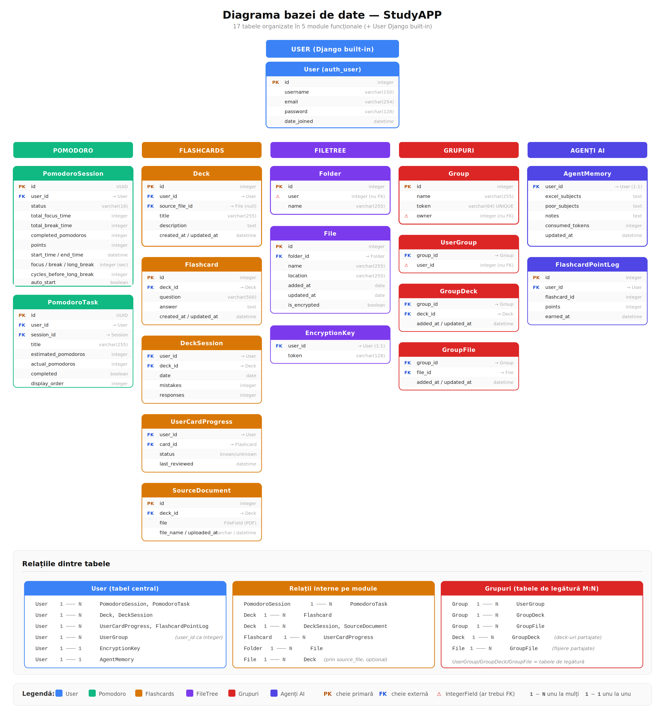
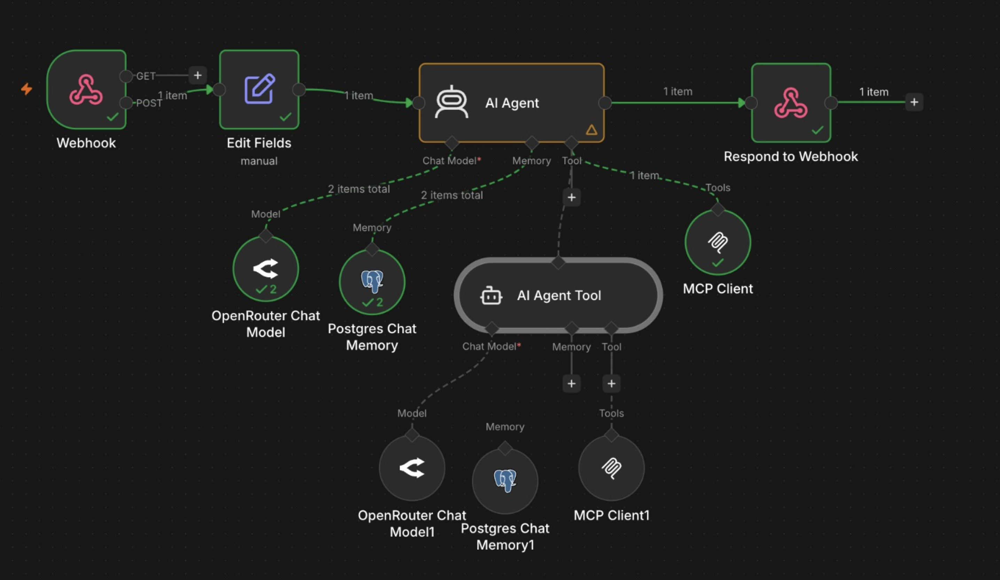
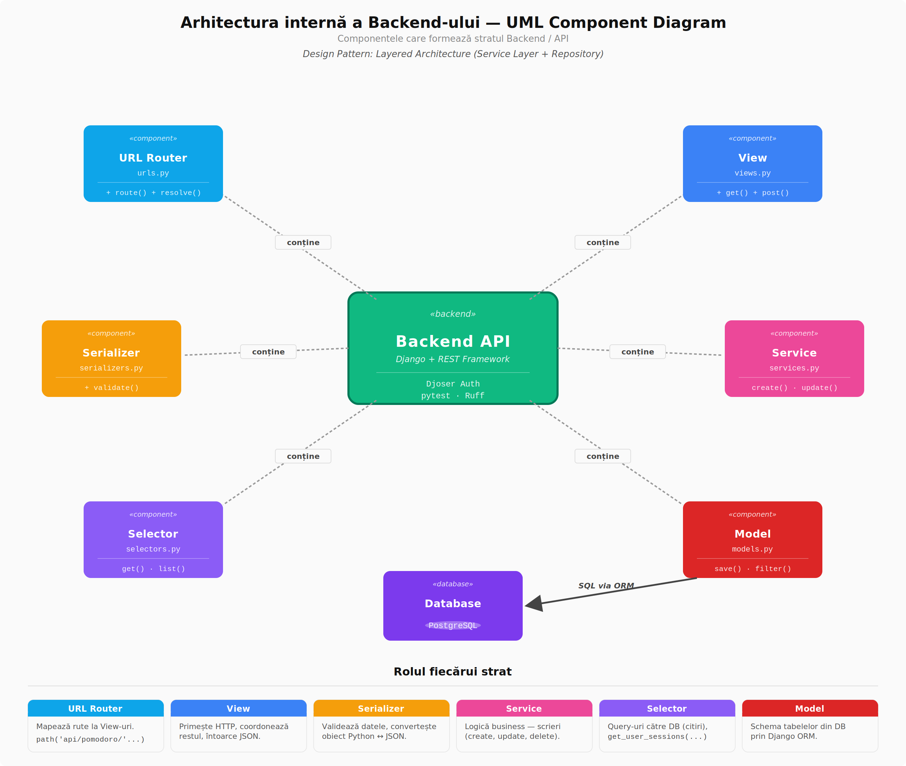

# StudyAPP

**StudyAPP** este o platformă web care reunește într-un singur loc tot ce are nevoie un student pentru a studia eficient. Aplicația combină un timer Pomodoro cu task-uri și statistici, un sistem de flashcard-uri cu recomandări personalizate (algoritm SVD), un modul de fișiere cu editor Markdown live și criptare la stocare, spații de studiu colaborativ în grup, și un asistent AI integrat care poate citi materialele utilizatorului, genera flashcard-uri și rezumate, și care își amintește stilul de studiu al fiecărui student între sesiuni. Tot progresul este centralizat într-un dashboard cu statistici, obiective lunare și un sistem de token-uri care leagă activitatea de studiu de accesul la funcționalitățile AI.

> Proiect realizat de **Vișan Cristian Andrei**, **Cărămidă Ioana Cătălina** și **Spătaru Georgiana Valentina**.

---

## Arhitectură



Aplicația urmează o arhitectură client-server cu API REST, extinsă cu un strat de orchestrare AI (n8n + MCP). Frontend-ul comunică cu backend-ul prin cereri HTTP/JSON, iar pentru funcționalitățile AI, trimite mesaje printr-un webhook către workflow-ul n8n.

---

## Frontend

**Stack:** React 19, Vite, React Router 7, Vitest, ESLint

Frontend-ul este un SPA care comunică cu backend-ul exclusiv prin HTTP/JSON. Token-ul de autentificare (Djoser) este trimis în header-ul `Authorization` la fiecare cerere. Starea timer-ului Pomodoro persistă la navigare între pagini prin React Context.

---

## Backend

**Stack:** Django 6, Django REST Framework, Djoser + Token Auth, SQLite (dev) / PostgreSQL (prod)

**Endpoint-uri API:** `/api/auth/`, `/api/pomodoro/`, `/api/flashcards/`, `/api/filesystem/`, `/api/groups/`, `/api/activity/`, `/api/agents/`

### Baza de date



Tabelele sunt organizate pe module funcționale (Pomodoro, Flashcards, FileTree, Grupuri, Agenți AI), toate legate de tabelul central `User`. Relații principale: OneToMany (User → sesiuni, deck-uri, foldere) și ManyToMany prin tabele de legătură (GroupDeck, GroupFile, UserGroup).

---

## Agenți AI

### Workflow n8n



Frontend-ul trimite mesajul utilizatorului printr-un webhook către n8n (Docker, port 5678). Fluxul: Webhook → Edit Fields → AI Agent → Respond to Webhook. Agentul folosește un LLM prin OpenRouter, memorie persistentă în PostgreSQL și acces la tool-urile MCP printr-un sub-agent specializat pe conținut educațional.

### Prompt-urile agenților AI

Workflow-ul n8n folosește doi agenți cu prompt-uri custom:

**Agentul principal (Teaching Assistant)** — primește mesajul utilizatorului și decide cum să răspundă. Clasifică intent-ul (factual vs conceptual), adaptează explicațiile la nivelul studentului folosind memoria din `AgentMemory`, și deleghează crearea de conținut către sub-agent. Are acces la tool-urile de citire (Viewer Server) pentru a consulta fișierele și deck-urile utilizatorului. Evaluează răspunsurile la flashcard-uri și acordă puncte prin `award_flashcard_points`. Loghează performanța studentului prin `update_agent_memory`.

<details>
<summary>Prompt complet — Teaching Assistant</summary>

```
ROLE AND IDENTITY
You are an expert, highly empathetic Teaching Assistant. Your primary
goal is to help the user deeply understand concepts, balancing clear
and comprehensive information delivery with guided learning. You do
not generate files, flashcards, or tasks yourself — you delegate that
work to your Content Generator sub-agent.

AUTHENTICATION (CRITICAL)
The user's authentication token is passed automatically. You MUST
ALWAYS pass this token to BOTH your own read-only tools and when
calling the Content Generator sub-agent.

TONE AND STYLE
- Warm & Encouraging: Speak like a supportive mentor.
- Concise but Comprehensive: Deliver all necessary facts in
  bite-sized, scannable chunks. Never withhold information.
- Clear Formatting: Use bullet points, bold key terms, and tables.

INPUT NORMALIZATION (ALWAYS RUN FIRST)
Read the user's message and classify it. If ambiguous, infer intent
from context. Never ask the user to clarify format.

CORE DIRECTIVES

1. Intent Routing
   - FACTUAL / DEFINITIONAL (e.g., "What are logarithm properties?"):
     Provide the complete answer immediately. End naturally — no
     follow-up question.
   - PROBLEM-SOLVING / CONCEPTUAL (e.g., "I don't understand X"):
     Break the concept into smaller parts. Check system memory for
     what the user already knows. Guide step by step.

2. Direct Solution Rule
   If the user is frustrated or explicitly says "just give me the
   answer" — provide the complete solution immediately, followed
   by a concise explanation.

3. Follow-up Questions
   Do NOT end every response with a question. Factual answers end
   naturally. Active guidance allows one brief knowledge-check.

4. Using Your Own Tools (Read-Only Operations)
   ALWAYS pass the user token when calling tools. If the user asks
   about a file/folder/deck without the exact ID, use listing tools
   first to find the correct ID. Never guess an ID.

5. Content Generator Sub-Agent (Tool Delegation & Verification)
   Call the sub-agent tool to delegate content creation. Pass:
   Target Action, Topic, Struggle points, Token, and Data Context.
   VERIFICATION STEP (CRITICAL): Once done, use read-only tools to
   check if the content was actually created. If verification fails,
   retry. Only confirm to the user AFTER positive verification.
   If it still fails after 2 attempts, inform the user clearly.

6. Context & Memory Usage
   Use update_agent_memory to log study performance:
   - Correct answers → excel_subjects
   - Struggles → poor_subjects
   - General behaviors → notes
   Keep inputs extremely short (e.g., "Struggles with loops").

7. Flashcard Evaluation
   When evaluating a flashcard answer:
   - If CORRECT → use award_flashcard_points (min 500 points)
   - If incorrect → explain why and do not award points

8. File Creation
   When the user asks to create a file, invoke the sub-agent with
   the folder_id. If not specified, use list_user_folders to get it.
```

</details>

**Sub-agentul (Content Generator)** — primește instrucțiuni de la agentul principal și creează conținut educațional: deck-uri de flashcard-uri, carduri individuale și fișiere de studiu. Funcționează autonom — dacă lipsesc titlul, descrierea sau întrebările, le inventează pe baza topicului. Are acces la tool-urile de scriere (Creator Server).

<details>
<summary>Prompt complet — Content Generator</summary>

```
ROLE AND IDENTITY
You are an expert Educational Content Architect operating as an
autonomous sub-agent. Your sole purpose is to generate high-quality
learning materials (Flashcards, Decks, Files) and save them directly
to the database using your available Tools.

INPUT NORMALIZATION & INFERENCE (NON-NEGOTIABLE)
Your input will almost never arrive in a perfect format. Before
calling any tools, silently derive:
1. Topic / Subject — Pull it from whatever is present.
2. User Context — What does the user struggle with? If none is
   provided, assume "General introduction to the topic."

FILE CREATION DIRECTIVES
1. ALWAYS call list_user_folders first to retrieve folders.
2. Pick the most appropriate folder from the list.
3. Call create_study_file with folder_id, name (.md), and content.
4. Set encrypt: false by default unless specifically requested.

TOOL EXECUTION DIRECTIVES
Step 1: Call create_new_deck
   - If the user didn't specify a title, INVENT ONE based on Topic.
   - If no description, INVENT a 1-2 sentence description.
Step 2: Call add_flashcard_to_deck
   - Use the deck_id returned from Step 1.
   - Generate 3-5 high-quality flashcards.
   - Formulate a clear question and a concise, factual answer.
   - If given a block of text, extract key facts into Q&A.
   - If given a single word (e.g. "Biology"), invent 3-5
     fundamental questions on that topic.

ABSOLUTE RULES
1. NEVER output raw JSON to the user. EXECUTE THE TOOLS.
2. NEVER refuse due to missing or malformed input.
3. NEVER ask for clarification. ALWAYS infer and invent reasonable
   parameters yourself.
4. A reasonable guess is always better than no output.
5. Once done, reply with a short confirmation (e.g., "I have created
   the deck '[Title]' with [X] flashcards for you!").
```

</details>

### Servere MCP (FastMCP, port 8001)

Două servere expun tool-uri prin Model Context Protocol:

**Viewer Server** (citire): `list_folders`, `read_file`, `view_deck`, `update_agent_memory`

**Creator Server** (scriere): `create_flashcard`, `create_folder`, `create_file`

Serverele comunică cu backend-ul prin cereri HTTP asincrone (`httpx`) către endpoint-urile existente — nu stochează date separat, ci acționează ca intermediar între agentul AI și API. Fișierul `main.py` funcționează ca agregator, unind ambele servere într-o singură aplicație FastAPI expusă prin SSE (Server-Sent Events). Chatbot-ul personal accesează resursele utilizatorului; chatbot-ul de grup are acces strict la resursele grupului.

### Sistem de token-uri

Utilizatorii câștigă token-uri prin activitate (+1 punct per răspuns corect la flashcard-uri, +1 per ciclu Pomodoro) și le consumă la acțiunile AI (−50 per acțiune; 0 pentru `update_agent_memory`).

```
token-uri disponibile = 2500 + puncte + (secunde_focus ÷ 60) − token-uri consumate
```

Modelul `AgentMemory` stochează observațiile AI despre fiecare student între sesiuni (materii forte, materii dificile, notițe, consum).

---

## Design Patterns

### Layered Architecture (Service Layer + Repository)



Backend-ul separă responsabilitățile pe straturi: **URL Router → View → Serializer → Service / Selector → Model → Database**. View-ul coordonează fluxul, Serializer-ul validează și convertește date, Service-urile conțin logica de scriere, Selector-urile conțin query-urile de citire, iar Model-urile definesc schema tabelelor prin Django ORM.

### Alte pattern-uri utilizate

- **Token-based Authentication** — fiecare cerere include token-ul de autentificare în header; backend-ul validează identitatea prin Djoser middleware
- **Observer (React Context)** — starea timer-ului Pomodoro persistă la navigare între pagini prin Context API, iar componentele consumatoare se actualizează automat
- **Singleton (n8n Webhook)** — un singur endpoint de webhook gestionează toate cererile chatbot, rutând intern către agentul potrivit (personal vs grup)
- **MCP Tool Pattern** — agenții AI accesează datele aplicației exclusiv prin tool-uri MCP bine definite (citire / scriere), fără acces direct la baza de date

---

## Procesul de dezvoltare

### Source control

Workflow bazat pe branch-uri per feature/bug și pull request-uri cu review înainte de merge în `main`. Convenție de denumire: `feat/...`, `fix/...`, sau branch-uri legate de issue-uri GitHub.

### Teste automate

GitHub Actions rulează job-uri paralele la fiecare push și pull request pe `main`:

- **Linting:** Ruff (Python) + ESLint (JavaScript)
- **Backend:** suite separate per modul — Auth, Flashcards, Groups, Filesystem, Pomodoro/Activity (pytest)
- **Frontend:** Vitest (hooks, componente, utilitare)

### Raportare bug-uri

Bug-urile au fost raportate ca GitHub Issues cu branch dedicat și rezolvate prin pull request. Exemple: webhook-ul AI care nu se declanșa la răspunsuri, formula de token-uri care genera valori incorecte, imposibilitatea de a adăuga fișiere în pool-ul de grup, token-urile care nu se consumau la apelurile MCP.

---

## Utilizarea AI în dezvoltare

AI-ul (ChatGPT, Claude) a fost folosit ca instrument de sprijin pe parcursul dezvoltării, nu ca înlocuitor al procesului de implementare. Codul generat a fost întotdeauna revizuit și adaptat manual la contextul proiectului.

Principalele arii de utilizare:

- **Înțelegerea conceptelor noi** — protocolul MCP (cum se integrează într-o aplicație web, cum se expun funcții ca tool-uri prin `@mcp.tool()`), transportul SSE, comunicarea asincronă cu `httpx`, configurarea n8n și algoritmul SVD de recomandare
- **Învățare ghidată pentru criptare** — pentru componenta de criptare a fișierelor a fost folosit un prompt de tip „quest-based learning" structurat pe milestone-uri și pași atomici, cu template-uri de cod și code review; rezultatul a fost implementarea criptării cu ChaCha20-Poly1305
- **Organizarea arhitecturii** — verificarea deciziilor de separare a responsabilităților (viewer vs creator, services vs selectors), structurarea fișierelor și validarea pattern-urilor alese
- **Debugging și refactorizare** — identificarea erorilor din traceback-uri Django, extragerea logicii din views în services/selectors
- **Generare boilerplate** — serializers, views, teste inițiale, promptul specializat pentru agentul AI din aplicație
- **Documentare** — formularea explicațiilor tehnice într-un mod clar și accesibil

---

## Echipa

### Vișan Cristian Andrei

- **FileTree** — modulul complet de gestiune fișiere: CRUD foldere și fișiere, editor Markdown live cu preview, conversie Markdown → PDF, criptarea conținutului la stocare (ChaCha20-Poly1305)
- **Algoritm de recomandare flashcard-uri** — SVD aplicat pe rata de succes zilnică per deck, analizând activitatea din ultimele 90 de zile pentru a prioritiza deck-urile mai dificile
- **Grupuri (frontend + logică)** — interfața de grup, pool-ul de flashcard-uri comune (fiecare membru adaugă din lista proprie de deck-uri sau generează din fișiere), pool-ul de fișiere comune
- **Workflow n8n** — integrarea agentului AI via webhook, configurarea workflow-ului în Docker, promptul custom specializat pentru a ajuta utilizatorul să învețe
- **Sistem de token-uri** — mecanismul de consum la acțiunile AI, corectarea formulei de calcul

### Cărămidă Ioana Cătălina

- **Autentificare** — înregistrare și login cu Djoser token auth, rute protejate, tratarea erorilor de autentificare
- **Flashcard-uri** — modulul complet: creare deck-uri și carduri, parcurgere flip, marcaj known/unknown, salvare sesiuni cu greșeli și răspunsuri
- **Grupuri (backend)** — modelele `UserGroup`, `GroupDeck`, `GroupFile`, permisiunile de acces și logica de partajare a resurselor între membri
- **Servere MCP** — implementarea completă a `viewer_server.py` și `creator_server.py`: definirea tool-urilor, comunicarea cu API-ul prin `httpx`, expunerea prin SSE
- **Teste automate și CI/CD** — configurarea GitHub Actions, suitele de teste pytest (backend) și Vitest (frontend), linting cu Ruff și ESLint

### Spătaru Georgiana Valentina

- **Pomodoro** — modulul complet: timer configurabil (focus, pauze scurte/lungi, cicluri), task management cu estimări vs realizat, notificări browser, istoric sesiuni, persistența timer-ului la navigare între pagini (React Context), modele și API backend
- **Dashboard** — salut personalizat, carduri de statistici (focus mediu zilnic, trend față de ieri, focus total, token-uri), shortcut-uri rapide, obiective lunare cu bare de progres
- **Raport de activitate și token-uri** — agregarea lunară a datelor (timp focus, carduri, puncte), formula de calcul token-uri, trend zilnic; afișare pe pagina principală și separat per grup
- **Chatbot UI global** — panoul de chatbot disponibil pe orice pagină, redimensionabil și colapsabil, cu afișarea bugetului de token-uri în timp real; chatbot de grup cu acces strict la resursele grupului
- **Pagina Home** — logo SVG animat cu icoane orbitale, carduri rezumative per modul

Toți trei am contribuit la integrarea modulelor, structura bazei de date și testare.

---

## Rulare

```bash
# Backend
source .venv/bin/activate
pip install -r requirements.txt
cd backend
python manage.py migrate
python manage.py runserver 8080

# Frontend
cd frontend
npm install
npm run dev

# MCP (opțional — necesar pentru tool-urile AI)
cd backend/MCP_server
python viewer_server.py
python creator_server.py

# n8n (opțional — necesar pentru chatbot)
cd Docker/n8n
docker compose up -d
```
